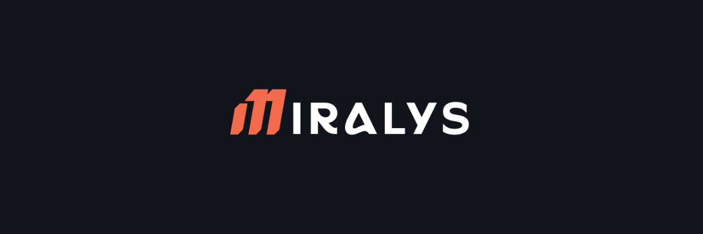
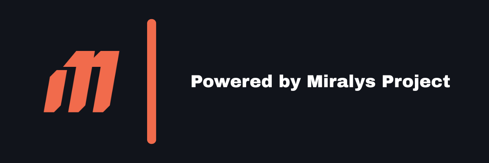

<div style="text-align: center;">



</div>
<div style="text-align: center;">


  <a href="LICENSE" target="_blank" rel="noopener noreferrer">
    
  </a>
  <a href="https://github.com/Miralys-Project/Miralys-Tournament/actions" target="_blank" rel="noopener noreferrer">
    
  </a>
  <a href="https://github.com/Miralys-Project/Miralys-Tournament/pulls" target="_blank" rel="noopener noreferrer">
    
  </a>
  <a href="https://github.com/Miralys-Project/Miralys-Tournament/issues" target="_blank" rel="noopener noreferrer">
    
  </a>
  <a href="https://discord.gg/pxkN36Yd2c" target="_blank" rel="noopener noreferrer">
    
  </a>
</div>

---

## 🎮 Project Overview

**Miralys Tournament** is a cross-platform tournament manager designed to organize, manage, and track gaming competitions with ease.  
Built with modern web and desktop technologies, it supports creating tournaments, managing players and teams, multiple game types, and social integrations.

---

## 🚀 Features

- Create and manage tournaments with customizable settings  
- Support for different game types (1v1, 2v2, etc.)  
- Player and team management with verification system  
- Integration with gaming platforms and social media  
- Dynamic match generation and ranking system  
- Cross-platform: Web, Desktop (Tauri), Mobile (Expo)  
- Open Source & Community-driven  

---

## 🛠️ Technologies Used

- **[React](https://reactjs.org/)** (frontend UI)  
- **[SCSS/SASS](https://sass-lang.com)** (CSS extension language)
- **[Vite](https://vitejs.dev/)** (build tool)  
- **[TypeScript](https://www.typescriptlang.org/)** (JavaScript super-set)  
- **[Express](https://expressjs.com/)** (backend API)  
- **[Discord.js](https://discord.js.org/)** (Discord bot integration)  
- **[Tauri](https://tauri.app/)** (desktop native app framework)  
- **[Expo](https://expo.dev)** (mobile native app framework) 
- **[pnpm](https://pnpm.io/)** (package manager)  
- **[Prisma](https://www.prisma.io)** (Database client)
- **[PostGreSQL](https://www.postgresql.org)** (Database server)
---

## ⚙️ Getting Started

### Prerequisites

- Node.js >= 22.18.0  
- Rust and Cargo (for Tauri) — install from [rustup.rs](https://rustup.rs)  
- pnpm package manager (recommended)  

### Installation

```bash
git clone https://github.com/Miralys-Project/Miralys-Tournament.git
cd Miralys-Tournament
pnpm install
cd apps/server
# Set up a ".env" file. SEE .env.example
pnpm run prisma:init
````

### Running in Development

* **Web app:**

```bash
pnpm --filter web dev
```

* **Desktop app (Tauri):**

```bash
pnpm --filter desktop tauri dev
```

* **Mobile app (Expo):**
```bash
# See package.json in apps/mobile
```

---

## 🧑‍💻 Contributing

Contributions are very welcome! Please check out the [CONTRIBUTING.md](.github/CONTRIBUTING.md) guide and the [code of conduct](.github/CODE_OF_CONDUCT.md).

Before submitting a PR:

* Run tests and linters
* Follow commit message guidelines

---

## 📄 License

This project is licensed under the [Apache 2.0 License](LICENSE).

---

## 🤝 Community & Support

Join our Discord to discuss, ask questions, and contribute:
[](https://discord.gg/pxkN36Yd2c)

---

Made with ❤️ by the Miralys Project Team

<div align="center">
  <a href="https://www.miralys.xyz" target="_blank" rel="noopener noreferrer">
    
  </a>

</div>